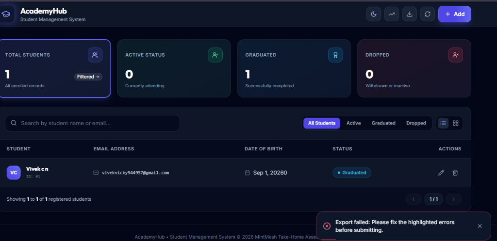

# AcademyHub — Student Management System (Fullstack)

[](https://fastapi.tiangolo.com/)
[](https://www.sqlalchemy.org/)
[](https://www.sqlite.org/)
[-61DAFB?style=flat&logo=react&logoColor=black)](https://react.dev/)
[](https://tailwindcss.com/)
[](https://docs.pytest.org/)

A fullstack **Student Management System** built with **FastAPI** (Python 3), **SQLAlchemy ORM**, **SQLite**, and a **React + Vite** single-page application styled with **Tailwind CSS** and **Framer Motion**.

Designed for the **MintMesh Take-Home Assessment (Fullstack SDE)** with a focus on strong backend fundamentals, validation, automated test coverage, and a responsive component-based UI.

---

## 📸 Screenshots & UI Showcase

### 1. Dashboard List View (Status Filtered & Dark Theme)


---

## 🚀 Quickstart (Clean Clone in < 5 Minutes)

### Prerequisites
- **Python 3.10+** (with `pip`)
- **Node.js 18+** (with `npm`)
- **Git**

### 1. Clone the Repository
```bash
git clone https://github.com/your-username/student-management-system.git
cd student-management-system
```

### 2. Backend Setup
```bash
# Navigate to backend directory
cd backend

# Create virtual environment
python -m venv venv

# Activate virtual environment
# Windows (PowerShell):
.\venv\Scripts\Activate.ps1
# macOS / Linux:
source venv/bin/activate

# Install dependencies
pip install -r requirements.txt

# Start FastAPI server (runs on port 8000)
uvicorn app.main:app --reload --port 8000
```
> **Note**: Database tables (`students.db`) are automatically created via SQLAlchemy metadata on startup. No manual migration or MySQL setup required.

- **Swagger Interactive API Docs**: [http://localhost:8000/docs](http://localhost:8000/docs)
- **ReDoc API Documentation**: [http://localhost:8000/redoc](http://localhost:8000/redoc)

### 3. Frontend Setup (New Terminal)
```bash
# Navigate to frontend directory
cd frontend

# Install dependencies
npm install

# Start Vite development server (runs on port 3000)
npm run dev
```
- **Web Application UI**: [http://localhost:3000](http://localhost:3000)

### 4. Running Backend Tests
```bash
# From the project root (with venv activated):
python -m pytest backend/tests/test_students.py -v
```

---

## 🛠️ Tech Choices & Rationale

| Layer | Choice | Rationale & Trade-offs |
|---|---|---|
| **Backend** | **FastAPI (Python)** | High-performance asynchronous REST framework. Provides native Pydantic schema validation, automatic OpenAPI / Swagger generation, and strict typing. |
| **Database** | **SQLite (via SQLAlchemy 2.0)** | Zero-configuration file database ensuring immediate setup for evaluators without configuring external services. Code is fully decoupled via SQLAlchemy ORM, making production migration to PostgreSQL/MySQL a one-line env change. |
| **Frontend** | **React + Vite** | Fast HMR build tooling with a clean component architecture. *(Note: React was selected as permitted by the assignment brief; Vue.js/Angular principles apply identically).* |
| **Styling & Animation** | **Tailwind CSS + Framer Motion** | Utility-first CSS allowing custom slate-indigo dark/light aesthetics. Framer Motion provides physics-based springs, sliding tab pills, and responsive layout transitions. |
| **Service Layer** | **Axios (`api.js`)** | Centralized API client isolating all HTTP calls and error formatting from React view components. |
| **Authentication** | **Omitted by Design** | Auth was intentionally omitted per assignment requirements to focus on clean fundamentals. |

---

## 📡 REST API Reference

| Method | Endpoint | Description | Status Codes |
|---|---|---|---|
| `POST` | `/students` | Register a new student record | `201 Created`, `400 Bad Request`, `409 Conflict` |
| `GET` | `/students` | List students (with pagination & status filter) | `200 OK` |
| `GET` | `/students/{id}` | Fetch a single student profile by ID | `200 OK`, `404 Not Found` |
| `PUT` | `/students/{id}` | Update student fields | `200 OK`, `400 Bad Request`, `404 Not Found`, `409 Conflict` |
| `DELETE` | `/students/{id}` | Permanently delete a student record | `200 OK`, `404 Not Found` |

### Error Response Schema
Validation and business errors return a structured JSON response:
```json
{
  "detail": "Validation Error",
  "errors": [
    {
      "field": "date_of_birth",
      "message": "Date of birth cannot be in the future."
    }
  ]
}
```

---

## 🧪 Automated Test Suite

The test suite in [`backend/tests/test_students.py`](backend/tests/test_students.py) exercises every endpoint and validation constraint:

```text
backend/tests/test_students.py::test_create_student_success PASSED               [ 14%]
backend/tests/test_students.py::test_create_student_validation_future_dob PASSED  [ 28%]
backend/tests/test_students.py::test_create_student_validation_empty_name PASSED  [ 42%]
backend/tests/test_students.py::test_create_student_duplicate_email PASSED        [ 57%]
backend/tests/test_students.py::test_get_student_not_found PASSED                 [ 71%]
backend/tests/test_students.py::test_get_students_pagination_and_filter PASSED   [ 85%]
backend/tests/test_students.py::test_update_and_delete_student PASSED             [100%]
================================= 7 passed in 1.61s =================================
```

---

## 🤖 AI Usage & Caught Mistakes

In accordance with the assignment guidelines, AI tools were utilized as an engineering accelerator. Here are **two concrete instances where the AI generated flawed code and how it was caught and resolved**:

### Catch 1: Pydantic v2 `Config` Deprecation & Schema Serialization
- **AI Output**: The AI initially used `class Config: orm_mode = True` (Pydantic v1 syntax) for converting SQLAlchemy models to Pydantic responses.
- **Problem**: Under Pydantic v2 / FastAPI modern releases, `orm_mode` is deprecated and triggers runtime deprecation warnings or serialization failures.
- **Fix**: Refactored the schema to use `model_config = ConfigDict(from_attributes=True)` and modern Pydantic field validators.

### Catch 2: Unbounded CSV Export vs. API Query Limits
- **AI Output**: When generating the CSV export routine in `App.jsx`, the AI generated `StudentService.getStudents({ limit: 10000 })`.
- **Problem**: FastAPI's route definition strictly enforces `limit: int = Query(10, ge=1, le=100)`. Requesting 10,000 caused the backend to return a `400 Bad Request` validation error, breaking the export.
- **Fix**: Re-engineered the frontend export handler to paginate through records in chunks of 100 adhering to API boundaries.

---

## 📁 Repository Structure

```text
student_manegementsystem/
├── backend/
│   ├── app/
│   │   ├── config.py         # App configuration & DB settings
│   │   ├── crud.py           # SQLAlchemy database query operations
│   │   ├── database.py       # Engine & session dependency
│   │   ├── main.py           # FastAPI entrypoint, CORS & error handlers
│   │   ├── models.py         # Student SQL model & EnrollmentStatus Enum
│   │   ├── routers/
│   │   │   └── students.py   # 5 REST endpoints
│   │   └── schemas.py        # Pydantic schemas & validators
│   ├── tests/
│   │   └── test_students.py  # 7 Pytest integration tests
│   ├── requirements.txt      # Python dependencies
│   └── .env.example          # Environment configuration template
├── frontend/
│   ├── src/
│   │   ├── components/
│   │   │   ├── AnalyticsChart.jsx      # Breakdown charts
│   │   │   ├── DeleteConfirmModal.jsx  # Confirmation dialog
│   │   │   ├── EmptyState.jsx          # Filter-aware empty screen
│   │   │   ├── ErrorBoundary.jsx       # Client crash safeguard
│   │   │   ├── Navbar.jsx              # Responsive header & theme toggle
│   │   │   ├── SkeletonRow.jsx         # Loading state placeholder
│   │   │   ├── StatsCards.jsx          # Metric cards & quick filters
│   │   │   ├── StudentFormModal.jsx    # Create/Edit modal with validation
│   │   │   ├── StudentTable.jsx        # Dual-mode responsive list
│   │   │   └── Toast.jsx               # Animated timed toast alert
│   │   ├── services/
│   │   │   └── api.js                  # Axios REST API service layer
│   │   ├── App.jsx                     # Root application state
│   │   ├── main.jsx                    # DOM entrypoint
│   │   └── index.css                   # Tailwind CSS directives
│   ├── package.json
│   ├── tailwind.config.js
│   └── vite.config.js
├── screenshots/              # UI verification screenshots
├── DESIGN.md                 # Architecture & design document
└── README.md                 # Setup & documentation
```

---

## 🔮 Known Limitations & Future Enhancements

1. **Authentication & Authorization**: Currently open for local assessment. In production, OAuth2 / JWT with role-based access control (Admin vs Faculty) would be implemented.
2. **Soft Deletion**: Records are permanently deleted from the database. A `deleted_at` timestamp column could be introduced for audit trailing.
3. **Database Migration Pipeline**: Production deployment would integrate **Alembic** for schema migrations.
